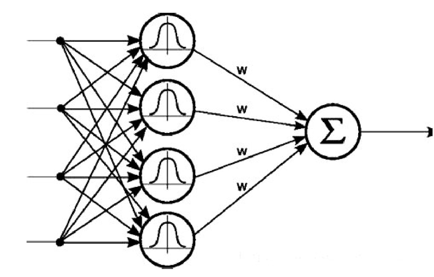

# RBF-Pytorch

A simple implementation of gaussian kernel Radial Basis Function layer using Pytorch

## Usage

Copy the `rbf.py` file to your project and import the RBFLayer to build your network.

## Example

In `example.py` you can find a simple example of using the RBF layer to build an RBF network and finish a 3-class classification task.
